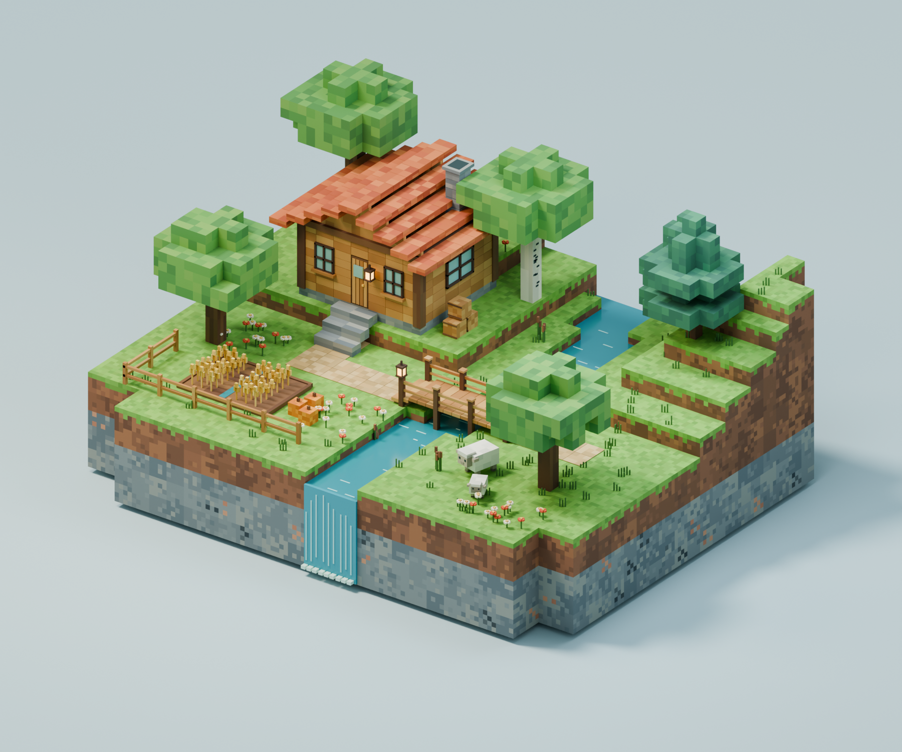

# My Minecraft World

[简体中文](README.zh-CN.md) | **English**

**[Play in your browser](https://xudafeng.github.io/my-minecraft-world/)**

A Minecraft-style forest world that started as a Blender voxel scene and grew into a first-person browser game. Cross the wooden bridge, explore the cabin, and mine and place blocks to build your own corner of the world.

Created with help from Codex. This repository includes the browser game source, a Blender scene generator, and an editable Blender project.

The game and documentation support English and Simplified Chinese, with English as the default. Use the **EN / 中文** switch in the top-right corner to change the interface language. Your browser remembers your choice, and switching languages preserves your world and player position. If the mouse is locked, press `Esc` to pause before switching.



_The image above is a Blender render. The browser game recreates the same theme in Three.js; its models and visuals differ from the Blender scene._

## Run locally

You need Node.js 22.13 or later, npm, and a browser with WebGL support. Installing dependencies requires an internet connection. Running locally requires no account or cloud service credentials.

```bash
npm install
npm run build
npm run start -- --ip 127.0.0.1 --port 4173
```

Open <http://127.0.0.1:4173> in your browser and click **Enter world**. Keep the terminal running; press `Ctrl+C` to stop the server.

For development, run `npm run dev` and open the local address printed in the terminal.

## GitHub Pages

The game is published at <https://xudafeng.github.io/my-minecraft-world/>. The workflow in [`.github/workflows/pages.yml`](.github/workflows/pages.yml) tests, builds, and deploys it whenever `main` is updated. In the repository's **Settings → Pages**, the publishing source is **GitHub Actions**.

To build and preview the same static version locally:

```bash
npm run build:pages
npm run preview:pages
```

Open the address printed in the terminal, including `/my-minecraft-world/`. This build reuses the game component and needs no backend server. Its assets are configured for the repository subpath in `vite.pages.config.ts`; update `base` there if you host it under another path.

## How to play

| Action                      | Controls                                                                            |
| --------------------------- | ----------------------------------------------------------------------------------- |
| Move                        | W / A / S / D or arrow keys                                                         |
| Look around                 | Move the mouse; if pointer lock is unavailable, hold the left mouse button and drag |
| Jump / Sprint               | Space / Shift                                                                       |
| Mine / Place                | Short left click / Right click                                                      |
| Select a block              | Number keys 1–6, scroll wheel, or click the hotbar                                  |
| Return to the cabin / Pause | R / Esc                                                                             |

The world includes a cabin, a bridge, a river, trees, a wheat field, and two decorative sheep. It features gravity, collision detection, mining particles, and six selectable building blocks. You play in first person with a visible arm. The touch interface provides buttons for movement, jumping, mining, and placing blocks.

This is a small creative-mode prototype: **refreshing the page resets the world**. Saving, multiplayer, and survival systems are not implemented. Bedrock cannot be mined, building is limited to the world bounds, and the sheep are decorative, without farming mechanics.

## Blender project

Open [`blender/voxel-grove.blend`](blender/voxel-grove.blend) in Blender. The terrain, buildings, trees, and props are editable, with all materials included.

See the [Blender guide](blender/README.md) for the generator and rebuild instructions. The Blender project is for modeling and rendering; use the browser game above to play.

## Project structure

```text
app/world-game.tsx       Game interface and input controls
app/globals.css          Interface styles
github-pages/           Static browser entry for GitHub Pages
vite.pages.config.ts    Static build and project subpath
lib/voxel-world.ts       World generation, collisions, and raycasting
lib/voxel-game.ts        Three.js rendering, player movement, and block interactions
lib/i18n.ts              Translations and language preferences
tests/                  Physics, interaction boundary, and language tests
blender/                Editable scene and Python generator
docs/images/            Blender render preview
```

Built with TypeScript, React, Three.js, Vinext, and Vite. Development and preview use a local Cloudflare Worker emulator. `.openai/hosting.json` contains empty configuration and is not tied to a personal deployment.

## Validation

```bash
npm test
npx tsc --noEmit
npm run build
```

Tests cover the spawn point, doorway, gravity, jumping, wall and ceiling collisions, ray hits, placement boundaries, and language preference storage. Basic movement and block interactions have been checked in a local browser. Touch controls have not yet been tested on a physical phone.

This is an independent project inspired by Minecraft's block-based style. It is not affiliated with Mojang or Microsoft.
